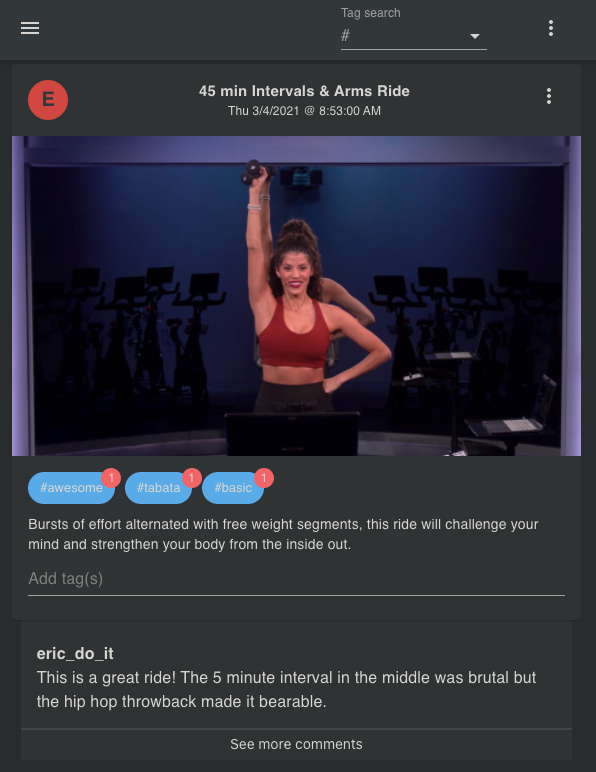

# helo-pelo
## Product Summary

I'm a big fan of my Peloton, but have always wanted to be able to leave and read comments on individual classes.

The feature isn't available on the application, so I built one that allows users to leave comments and searchable tags, so they can find and discuss rides they like.

Rides are generated by pulling from Peloton's API then storing on my Postgres DB. Everything else - user accounts, comments, are unlinked from the actual site, i.e. I have no visibility over a user's Peloton login.




## Features

- **FastAPI** with Python 3.8
- **React 16** with Typescript, Redux, and react-router
- Material-UI CSS framework
- Postgres
- SqlAlchemy with Alembic for migrations
- Pytest for backend tests
- Jest for frontend tests
- Perttier/Eslint (with Airbnb style guide)
- Docker compose for easier development
- Nginx as a reverse proxy to allow backend and frontend on the same port

## Development

The only dependencies for this project should be docker and docker-compose.

### Quick Start

Starting the project with hot-reloading enabled
(the first time it will take a while):

```bash
docker-compose up -d
```

To run the alembic migrations (for the users table):

```bash
docker-compose run --rm backend alembic upgrade head
```

To create a new revision with a version tag, e.g. "Adds users table"

```bash
docker-compose run --rm backend alembic revision --autogenerate -m <VERSION TAG>
```

And navigate to http://localhost:8000

_Note: If you see an Nginx error at first with a `502: Bad Gateway` page, you may have to wait for webpack to build the development server (the nginx container builds much more quickly)._

Auto-generated docs will be at
http://localhost:8000/api/docs

### Rebuilding containers:

```
docker-compose build
```

### Restarting containers:

```
docker-compose restart
```

### Bringing containers down:

```
docker-compose down
```

### Frontend Development

Alternatively to running inside docker, it can sometimes be easier
to use npm directly for quicker reloading. To run using npm:

```
cd frontend
npm install
npm start
```

This should redirect you to http://localhost:3000

### Frontend Tests

```
cd frontend
npm install
npm test
```

## Migrations

Migrations are run using alembic. To run all migrations:

```
docker-compose run --rm backend alembic upgrade head
```

To create a new migration:

```
alembic revision -m "create users table"
```

And fill in `upgrade` and `downgrade` methods. For more information see
[Alembic's official documentation](https://alembic.sqlalchemy.org/en/latest/tutorial.html#create-a-migration-script).

## Testing

There is a helper script for both frontend and backend tests:

```
./scripts/test.sh
```

### Backend Tests

```
docker-compose run backend pytest
```

any arguments to pytest can also be passed after this command

### Frontend Tests

```
docker-compose run frontend test
```

This is the same as running npm test from within the frontend directory

## Logging

```
docker-compose logs
```

Or for a specific service:

```
docker-compose logs -f name_of_service # frontend|backend|db
```

## Project Layout

```
backend
└── app
    ├── alembic
    │   └── versions # where migrations are located
    ├── api
    │   └── api_v1
    │       └── endpoints
    ├── core    # config
    ├── db      # db models
    ├── tests   # pytest
    └── main.py # entrypoint to backend

frontend
└── public
└── src
    ├── components
    │   └── Home.tsx
    ├── config
    │   └── index.tsx   # constants
    ├── __tests__
    │   └── test_home.tsx
    ├── index.tsx   # entrypoint
    └── App.tsx     # handles routing
```
